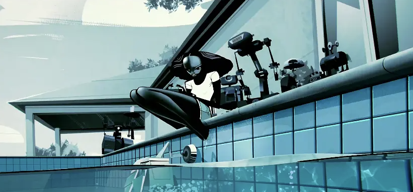
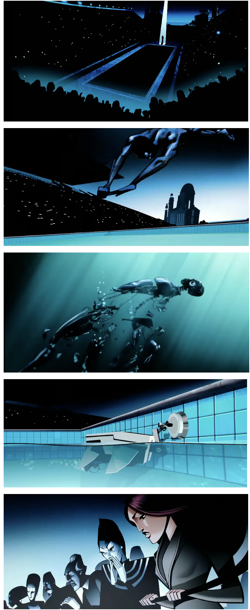
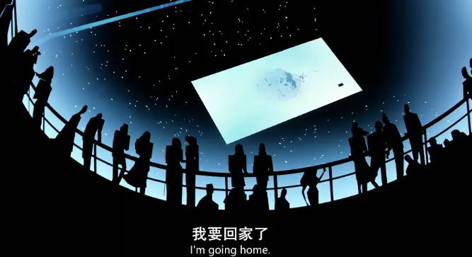
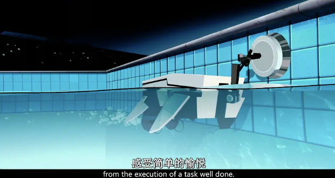

+++
title = "我为什么应该写作"
date = "2023-05-18"
description = "一些对写作这一技艺的思考"
tags = [
    "随笔"
]
+++

当我想要写作时，或者说需要口头正式表达观点时，我发现我变得更加“内向”。其实我在社交时是一个很外向的人，我会故意制造话题、活跃气氛、用夸张的故事引人发笑。但当我认真地想要表达一些东西时，我的脑子停机了。混乱的思绪在脑中纠缠在一起，我总是不能将它们快速理清。我现在的问题是想得太多，表达得太少。这常令我痛苦。

而且最近也发现很多知名程序员也都提倡表达，比如尝试写作、绘画与音乐。这一阵因为工作繁忙，心情不佳，所以用“买买买”来缓解压力。我买了一个数位板来尝试进行数字绘画。我找到了很好的入门教程并按照指导完成了第一次临摹。另外我也买了一支笛子，在早上也时常练习。但我发现，这些技艺需要长时间练习，现在我的水平并不足以支撑自己表达想法。这真令人沮丧。但是写作是现在就可以用来表达的，虽然我现在的写作水平也不咋地233。最近在看一本书《On Writing Well》，作者说写作本身就是一件“困难”的技艺（crafting）。用写作来表达自己，只有时时锤炼自己的写作能力，才能更好地表达自己。

最后我发现我经常把一些事情搞得太复杂了。因为我的思维有时太过跳脱，而且比较擅长搜集资料，所以当我做事情时往往会被海量的方法与信息淹没，在不断尝试和选择中迷失，失去自己原本的目标。想要画画是如此，想要演奏音乐也是如此。简简单单一点，Simple is better than complex. 我只需要表达。虽然写作看上去很枯燥无聊，但它胜在简单，纸和笔、键盘与屏幕足矣。但它也很难，需要时时打磨。

Netflix 的科幻剧集《Love, Death and Robots》中，我最喜欢的一集就是《Zima Blue》。故事梗概如下（[来自豆瓣](https://movie.douban.com/review/12546079/)）：
> 曾经，一位才华横溢的年轻女士创造了几十个机器人来处理各种家务，但她特别喜欢那个用来清洁泳池瓷砖的机器人。

> 她为小机器人增加了各种功能，比如全彩色视觉系统、能够做出自我决策的大脑，并且试验了各种软件程序，让它变得更有意识。后来，那个女人去世了，小机器人被传给了一个又一个主人。他们给它添加了更多的功能，最终，它越来越像人类——这就是 Zima。

> Zima 也不知道自己究竟是什么？是有机器零件的人类，还是有意识的机器。他也忘了自己曾经的样子。唯一有印象的，就是那种蓝色，于是他一直在追寻和体验这种蓝色。经历了宇宙间的探索，最终，他回到了这里，他曾经被创造出来的地方——那个泳池。而泳池上的蓝色瓷砖，就是他诞生时所见到的第一件物品，那种蓝色，也印在了他的记忆深处，这就是 Zima Blue。在获得了名誉、地位、成功之后，在经历了从天到地的探索之后。Zima 的内心，仍然在渴望着那个源头。他找到了自己真实的身份和原本的样子。他拆解了自己完美的人型躯体，变回简陋的小机器人，回归到了他的本源。

> 正如他跳进泳池前所说的：“我对真相的探索终于结束了，我要回家了。”

Be foolish, be simple.